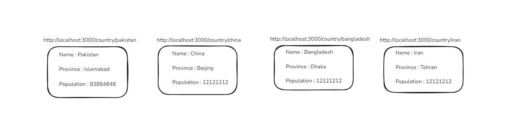

## Task: Building a Next.js Application with Dynamic Routes

**Create a dynamic routing system:**
*   Set up dynamic routes for country names using the app router in Next.js. Each route will dynamically display details for a specific country based on the URL.

**Create a country listing page:**
*   Build a static page that lists five countries of your choice. Each country name should be clickable, linking to its respective dynamic route (e.g., /country/\[country\_name\]).

**On the dynamic route page, display the following details for the selected country**
*   Name
*   Population
*   Capital

Use a JavaScript object to store the details of the countries you want to display. For each country, you should include the name, population, and capital. When a user visits the dynamic route for a specific country (e.g., / country /canada), the application should search for that country in the object.  

1.  If the country is found in the object, display the country’s details.
2.  If the country is not found, display a message: "Country not found."




This is a [Next.js](https://nextjs.org) project bootstrapped with [`create-next-app`](https://nextjs.org/docs/app/api-reference/cli/create-next-app).

## Getting Started

First, run the development server:

```bash
npm run dev
# or
yarn dev
# or
pnpm dev
# or
bun dev
```

Open [http://localhost:3000](http://localhost:3000) with your browser to see the result.

You can start editing the page by modifying `app/page.tsx`. The page auto-updates as you edit the file.

This project uses [`next/font`](https://nextjs.org/docs/app/building-your-application/optimizing/fonts) to automatically optimize and load [Geist](https://vercel.com/font), a new font family for Vercel.

## Learn More

To learn more about Next.js, take a look at the following resources:

- [Next.js Documentation](https://nextjs.org/docs) - learn about Next.js features and API.
- [Learn Next.js](https://nextjs.org/learn) - an interactive Next.js tutorial.

You can check out [the Next.js GitHub repository](https://github.com/vercel/next.js) - your feedback and contributions are welcome!

## Deploy on Vercel

The easiest way to deploy your Next.js app is to use the [Vercel Platform](https://vercel.com/new?utm_medium=default-template&filter=next.js&utm_source=create-next-app&utm_campaign=create-next-app-readme) from the creators of Next.js.

Check out our [Next.js deployment documentation](https://nextjs.org/docs/app/building-your-application/deploying) for more details.
