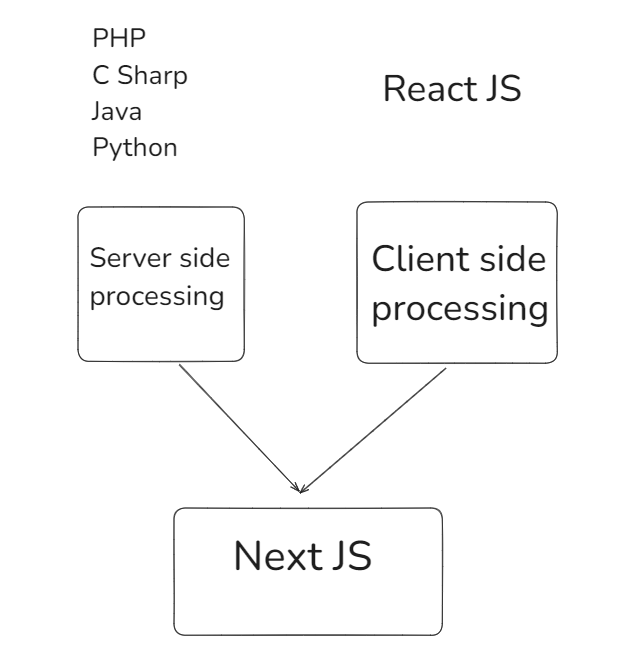
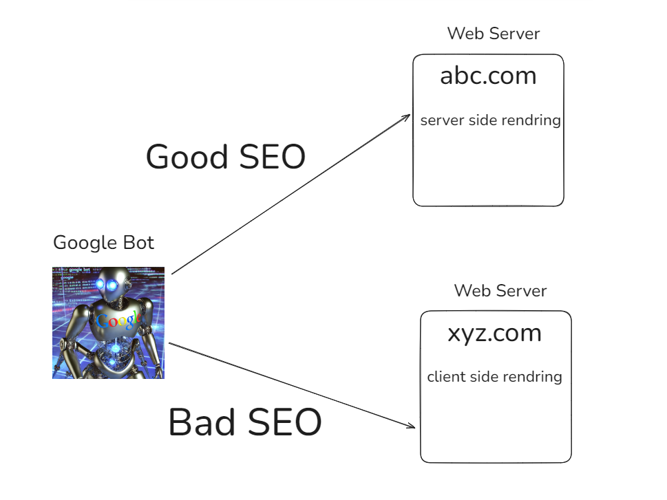

## Task 1: Building a Next.js Application with Dynamic Routes using Component

---

**Assignment Instructions:**

Modify the previous assignment to display country details using dynamic routes. Convert the country detail card into a component, pass the country information as props to the component, and display the data for each country.

For example:
- **Name**: Pakistan
- **Population**: 4,343,434
- **Capital**: Islamabad

---

## Task 2: Build a Personal Resume Website

In this task, you will create a simple one-page website about yourself using **HTML** and **CSS** in **NEXTJS environment**. This website will serve as your personal resume. Follow the guidelines below to complete the assignment:

### Requirements:
1. **Basic Information Section**:
   - Include your name, a professional title (e.g., "Aspiring Web Developer"), and a brief introduction about yourself.
   
2. **Contact Information**:
   - Provide your email, phone number, and any other relevant contact information (LinkedIn, GitHub, etc.).
   
3. **Skills Section**:
   - List your key skills (e.g., HTML, CSS, JavaScript, problem-solving, teamwork, etc.).
   
4. **Education Section**:
   - Mention your educational background (e.g., school, college, university, or any courses you have taken).
   
5. **Experience Section** (if applicable):
   - Include any previous jobs, internships, or relevant experiences (can also be projects you’ve worked on).
   
6. **Portfolio Section** (optional):
   - Showcase any projects or personal work you’ve done by adding links or descriptions.

7. **Design**:
   - Use **HTML** for structure and **CSS** for styling.
   - Ensure your page is well-structured and visually appealing.
   - Consider using fonts, colors, and spacing to make your website easy to read.

### Bonus Points:
- Add a simple **navigation bar** that scrolls smoothly to different sections of your one-page resume.

---

This is a great opportunity to practice your HTML and CSS skills while showcasing who you are and your accomplishments!

---
## Learning videos of HTML, CSS and GIT
[Learn HTML by Hira Khan (Watch Recorded Videos)](https://www.youtube.com/playlist?list=PLKvqnz8z1zWQ3BALy86tIXICkG874wAc6)

[Learn CSS Intro by Hira Khan (Watch Recorded Videos)](https://www.youtube.com/playlist?list=PLKvqnz8z1zWQSWIen_zUSEBmtqzPLuRob)

[Learn Git & GitHub by Zeeshan Hanfi](https://www.youtube.com/playlist?list=PLKueo-cldy_HjRnPUL4G3pWHS7FREAizF)

[Start building with Next.js](https://nextjs.org/learn?utm_source=next-site&utm_medium=homepage-cta&utm_campaign=home)

[React Foundations](https://nextjs.org/learn/react-foundations)

[NextJS Documentation](https://nextjs.org/docs)

---






---

This is a [Next.js](https://nextjs.org) project bootstrapped with [`create-next-app`](https://nextjs.org/docs/app/api-reference/cli/create-next-app).

## Getting Started

First, run the development server:

```bash
npm run dev
# or
yarn dev
# or
pnpm dev
# or
bun dev
```

Open [http://localhost:3000](http://localhost:3000) with your browser to see the result.

You can start editing the page by modifying `app/page.tsx`. The page auto-updates as you edit the file.

This project uses [`next/font`](https://nextjs.org/docs/app/building-your-application/optimizing/fonts) to automatically optimize and load [Geist](https://vercel.com/font), a new font family for Vercel.

## Learn More

To learn more about Next.js, take a look at the following resources:

- [Next.js Documentation](https://nextjs.org/docs) - learn about Next.js features and API.
- [Learn Next.js](https://nextjs.org/learn) - an interactive Next.js tutorial.

You can check out [the Next.js GitHub repository](https://github.com/vercel/next.js) - your feedback and contributions are welcome!

## Deploy on Vercel

The easiest way to deploy your Next.js app is to use the [Vercel Platform](https://vercel.com/new?utm_medium=default-template&filter=next.js&utm_source=create-next-app&utm_campaign=create-next-app-readme) from the creators of Next.js.

Check out our [Next.js deployment documentation](https://nextjs.org/docs/app/building-your-application/deploying) for more details.
